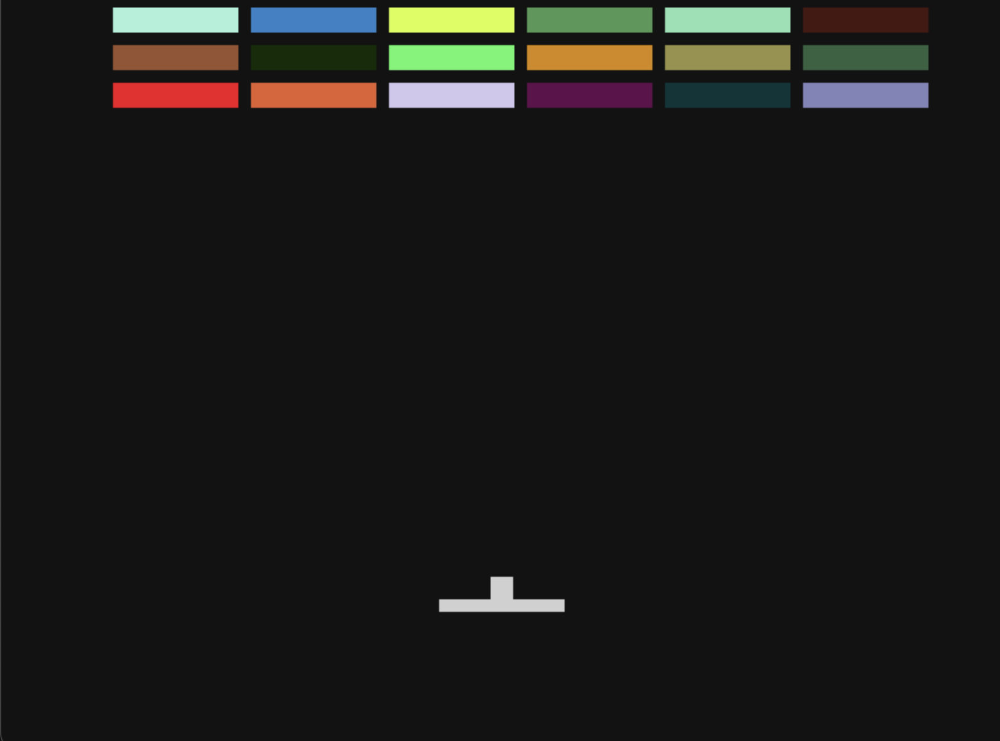

# Breakout Game in Zig

Welcome to the Breakout game project written in Zig!

## Table of Contents
- [Introduction](#introduction)
- [Features](#features)
- [Installation](#installation)
- [Usage](#usage)
- [Contributing](#contributing)
- [License](#license)

## Introduction

This project is a simple implementation of the classic Breakout game using the Zig programming language. The goal is to break all the bricks using a ball while preventing the ball from falling off the screen using a paddle.

I was inspired by tsoding and his project [zigout](https://github.com/tsoding/zigout). So I'm sorry if my code have quite a resemblance of his. You can check out his [stream](https://www.youtube.com/watch?v=eIX9zER9vjY) as well.

Here is a picture of the game: 



## Features

- Classic Breakout gameplay
- Simple and clean codebase
- Written in Zig

## Installation

To build and run the game, you need to have Zig installed on your system. You can download Zig from the [official website](https://ziglang.org/download/).

Clone the repository:

```sh
git clone https://github.com/yourusername/breakout-zig.git
cd breakout-zig
```

Build the project:

```sh
zig build
```

## Usage

Run the game:

```sh
zig build run
```

Use the 'a' and 'd' keys to move the paddle and try to break all the bricks!

## License

This project is licensed under the MIT License. See the [LICENSE](LICENSE) file for details.
